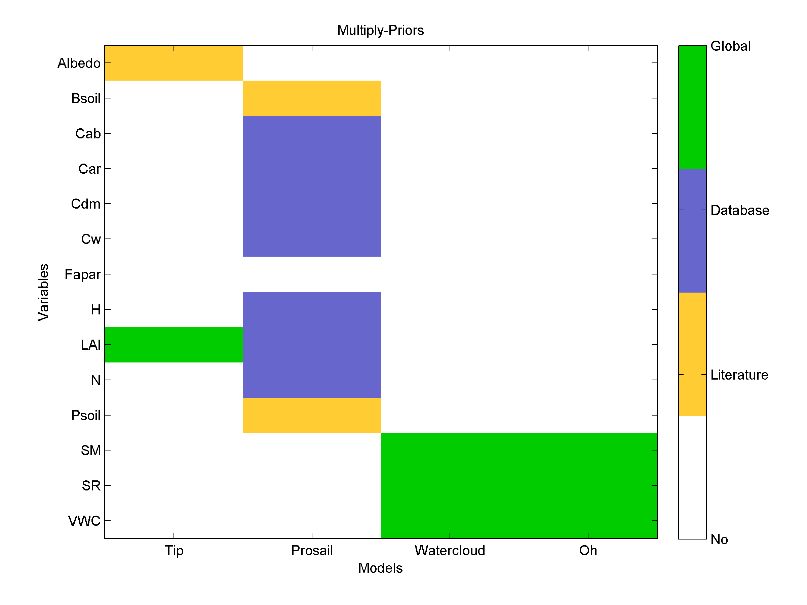
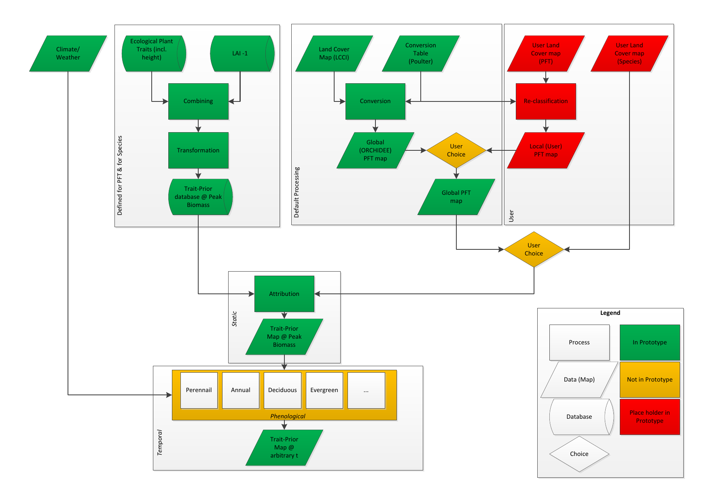
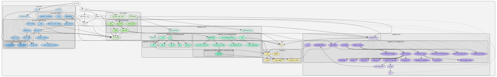

Processing
============

Priors are provided for the respective forward operators. The relationships are shown in following figure:

   Figure 1: Relationship of priors to their respective forward operators.

Description of Processing
--------------------------
This prototype is capable of delivering for both vegetation priors as well as soil priors spanning all variables required in the forward operators. The overall processing chain is divided up to two parts (dealing with the soil prior and the vegetation prior).

The optical prior engine is designed to deliver prior information to the inference engine specifically for the leaves and vegetation. The overall flow of the prior-engine is illustrated by Figure 2.

The 'microwave' prior engine is designed to deliver prior information for soil parameters. The overall flow of the prior-engine is illustrated by Figure 3.

In these flowcharts a distinction is made between the current implementation of the prototype (green) and the final foreseen version of the prior engine (red). Within the prototype version of the module, the values of the priors are consistent with @peak biomass; no dynamical component is integrated into the prototype module. In order for completeness a place-holder (orange) process is embedded into the flowchart. In addition, in the final version of the prior engine it is foreseen that the users themselves can choose between how the specific prior are created. It is foreseen that these user-selections will be obtained from the configuration-file with which the MULTIPLY framework is run. itself. This is represented in the flowchart by orange selection boxes.
Prior data specified by the User is currently not visualized.

   Figure 2: Flow in 'optical' prior engine

.. note::

   TBD
   Figure 3: Flow in 'microwave' prior engine

Technical Description
-----------------------

The processing chain in the prior engine is defined in a config file.
For now this looks like:

.. literalinclude:: ../multiply_prior_engine/sample_config_prior.yml

The internal flow and relations can be seen in figure 4.

   Figure 4: Prior Engine relationships
